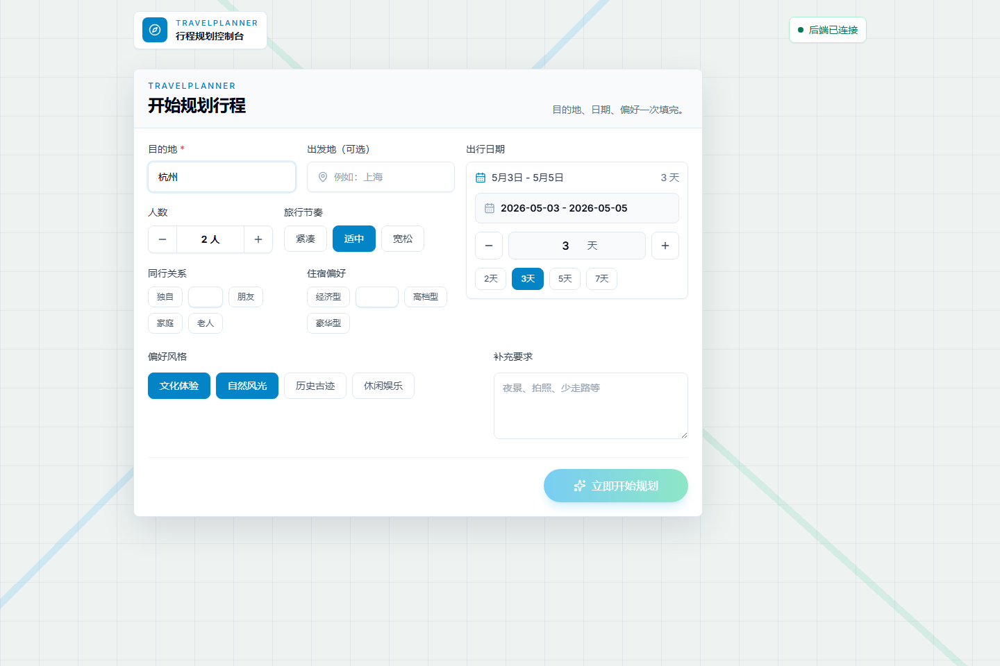
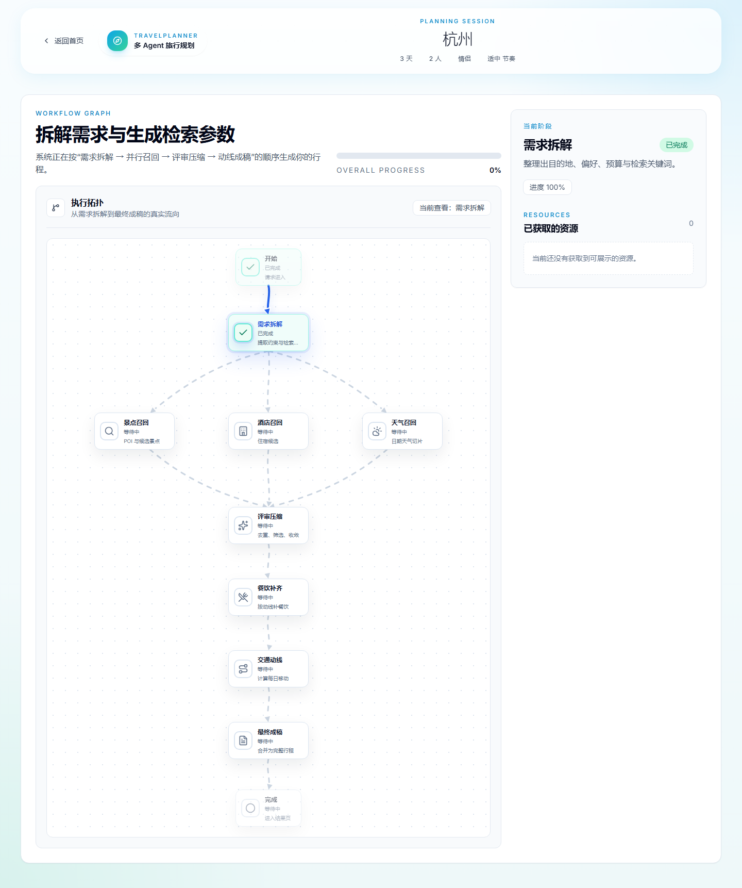
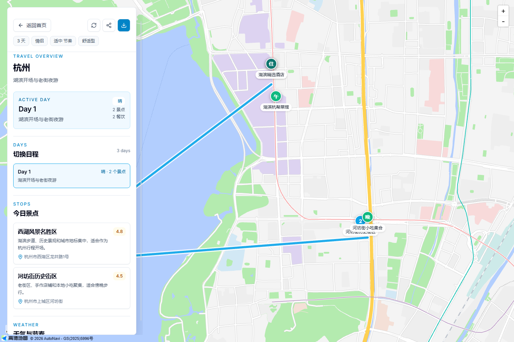

# TravelPlanner

TravelPlanner 是一个多 Agent 智能旅行规划系统。用户输入目的地、日期、人数、旅行节奏、住宿偏好和兴趣风格后，系统会并行召回景点、酒店、天气等信息，再经过评审、餐饮补充、交通动线规划和最终成稿，生成可视化的多日旅行方案。

这个项目不是静态攻略页，而是一个可运行的前后端应用：前端负责填写需求、展示 Agent 执行进度和渲染结果；后端负责 LangGraph 编排、地图数据检索、LLM 规划和 SSE 流式推送。



## 技术栈

前端：

- Vue 3
- TypeScript
- Vite
- Pinia
- Vue Router
- Tailwind CSS
- Vitest
- Playwright
- 高德地图 Web JS API

后端：

- Python 3.10+
- FastAPI
- LangGraph
- LangChain
- FastMCP
- Pydantic
- pytest
- 高德地图 Web Service API
- DashScope / DeepSeek 兼容 OpenAI 风格接口

## 具体功能

### 旅行需求填写

首页提供完整的旅行需求表单，支持填写目的地、出发地、日期范围、人数、同行关系、旅行节奏、住宿偏好、偏好风格和补充要求。前端会保存草稿，刷新后可以继续编辑。

### 多 Agent 规划流程

后端使用 LangGraph 组织规划流程：

```text
需求拆解
  -> 并行召回：景点 Agent / 酒店 Agent / 天气 Agent
  -> 评审 Agent
  -> 餐饮 Agent
  -> 交通 Agent
  -> 成稿 Agent
```

前端通过 SSE 实时接收每个 Agent 的开始、进度、阶段结果和完成事件，并用流程图展示当前执行位置。



### 地图与行程结果

结果页以地图为主视图，侧边栏展示每天的行程、景点、餐饮、天气、住宿和预算信息。地图会根据行程点位展示路线；未配置地图 Key 时，页面仍可回退到内置路线示意。



### 本地 MCP 工具

后端启动时会初始化本地 FastMCP stdio 服务，当前工具位于 `backend/app/ai/mcp/amap_stdio_server.py`：

- `maps_text_search`
- `maps_weather`

这些工具由后端 Agent 调用，用于搜索 POI 和天气数据。

### 测试覆盖

项目包含后端单元测试、前端类型检查、前端单元测试、构建检查和端到端测试。E2E 测试会覆盖首页提交、规划页跳转、结果页展示、移动端布局和本地存储容量边界。

## 项目结构

```text
backend/
  app/
    ai/          LangGraph 节点、模型、MCP 客户端、LLM 工具
    api/         FastAPI 路由
    config/      配置和日志
    services/    高德服务封装
  tests/         后端测试

frontend/
  src/
    app/         Vue 应用入口和路由
    components/ 业务组件和基础 UI
    pages/      首页、规划页、结果页
    services/   API 和本地存储
    stores/     Pinia 状态
    types/      前端类型
  tests/e2e/    Playwright 端到端测试

docs/images/    README 截图
```

## 环境准备

安装基础环境：

- Python 3.10+
- Node.js 18+
- uv

初始化后端：

```powershell
cd backend
uv sync --extra dev
Copy-Item .env.example .env
```

初始化前端：

```powershell
cd frontend
npm install
Copy-Item .env.example .env
```

后端 `backend/.env`：

```env
AMAP_MAPS_API_KEY=your_amap_web_service_key
DASHSCOPE_API_KEY=your_dashscope_api_key
DEEPSEEK_API_KEY=your_deepseek_api_key
DASHSCOPE_BASE_URL=https://dashscope.aliyuncs.com/compatible-mode/v1
DEEPSEEK_BASE_URL=https://api.deepseek.com/v1
LLM_MODEL=deepseek-chat
LLM_TEMPERATURE=1.3
PORT=8000
DEBUG=false
LOG_LEVEL=INFO
```

前端 `frontend/.env`：

```env
VITE_API_BASE_URL=http://127.0.0.1:8000/api/v1
VITE_AMAP_KEY=your_amap_web_js_key
VITE_AMAP_SECURITY_JS_CODE=your_amap_security_js_code
```

## 本地启动

启动后端：

```powershell
cd backend
uv run uvicorn app.main:app --host 127.0.0.1 --port 8000
```

启动前端：

```powershell
cd frontend
npm run dev -- --host 127.0.0.1 --port 5173
```

访问地址：

- 前端：`http://127.0.0.1:5173`
- 后端：`http://127.0.0.1:8000`
- 健康检查：`http://127.0.0.1:8000/api/v1/travel/health`
- API 文档：`http://127.0.0.1:8000/docs`

## 测试

后端：

```powershell
cd backend
uv run pytest
```

前端：

```powershell
cd frontend
npm run typecheck
npm run lint
npm run test:unit
npm run build
npm run test:e2e
```

## API

核心接口：

- `GET /api/v1/travel/health`
- `POST /api/v1/travel/plan`
- `POST /api/v1/travel/plan/sync`
- `GET /api/v1/mcp/tools`
- `GET /api/v1/mcp/tools/{tool_name}`
- `POST /api/v1/mcp/tools/{tool_name}/invoke-raw`

`POST /api/v1/travel/plan` 使用 `text/event-stream` 返回规划事件，前端会按事件类型更新 Agent 状态、阶段产物和最终行程。
